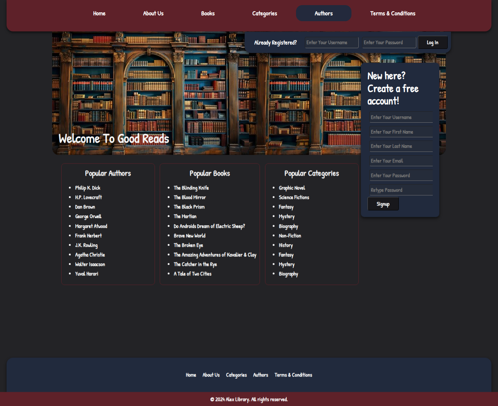
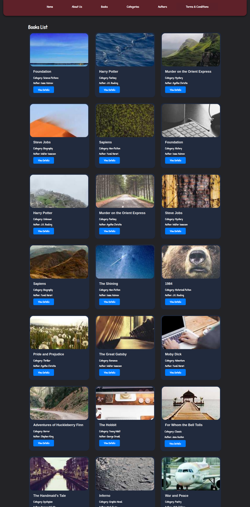
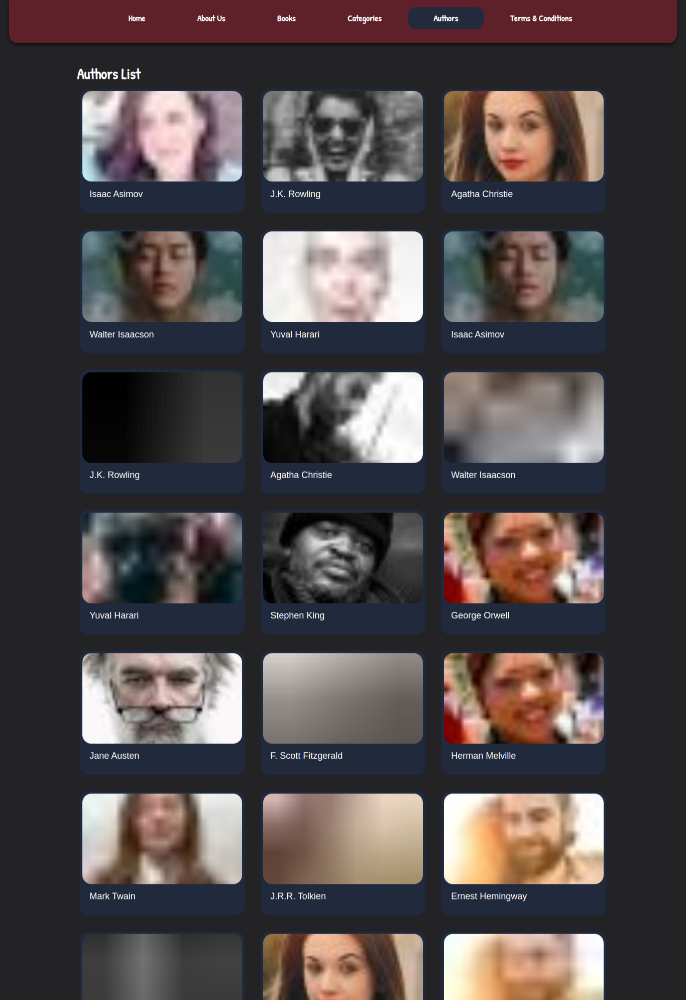
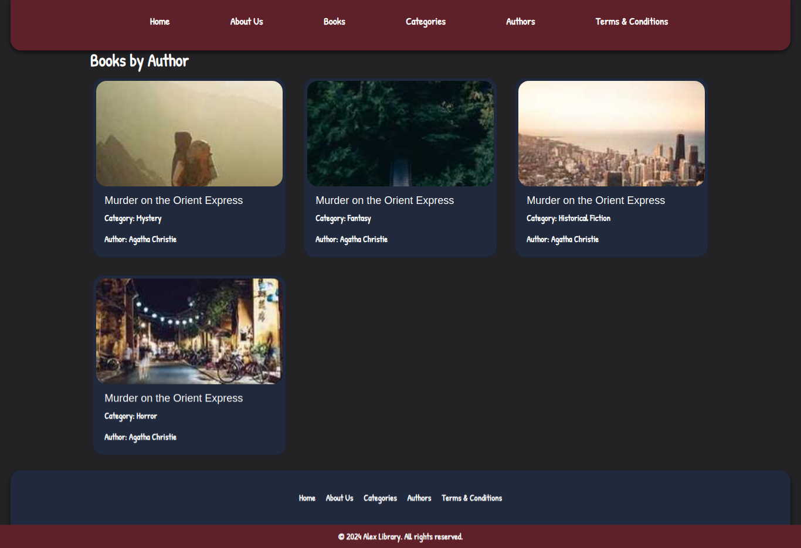
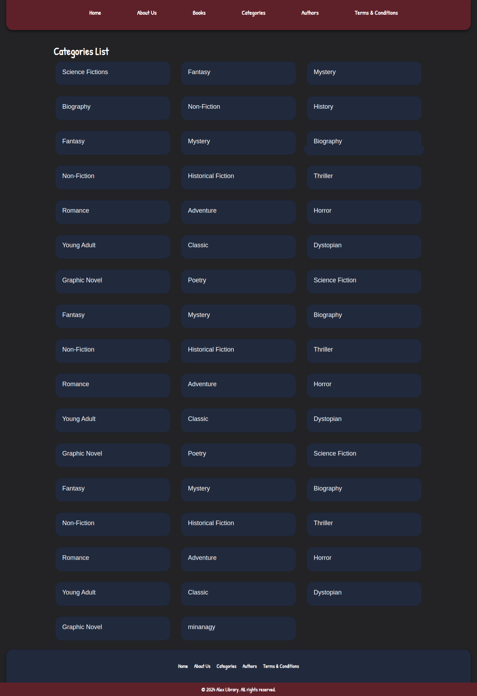
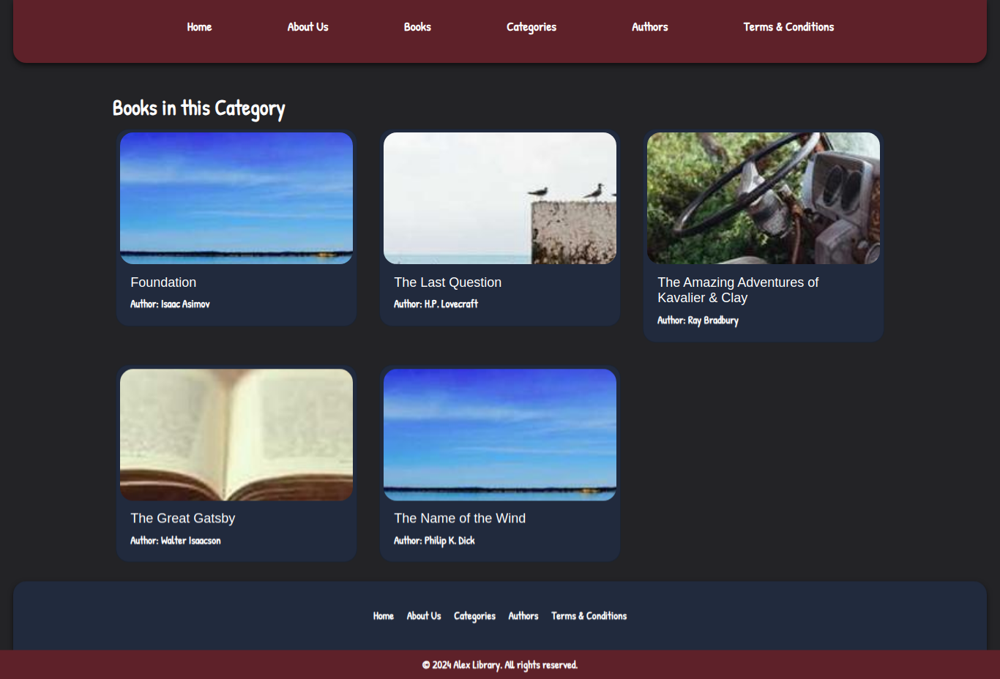
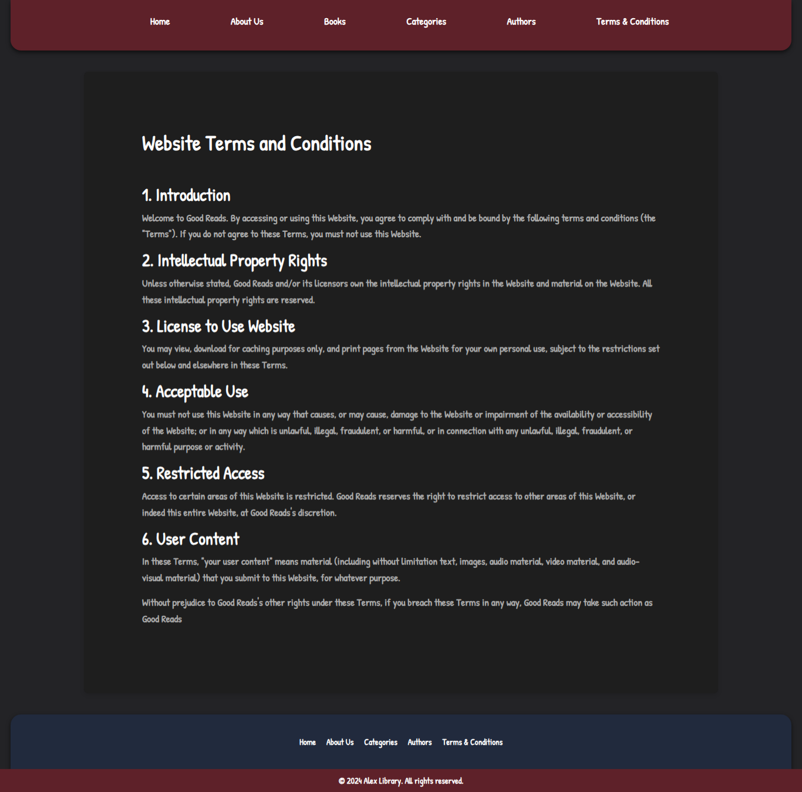
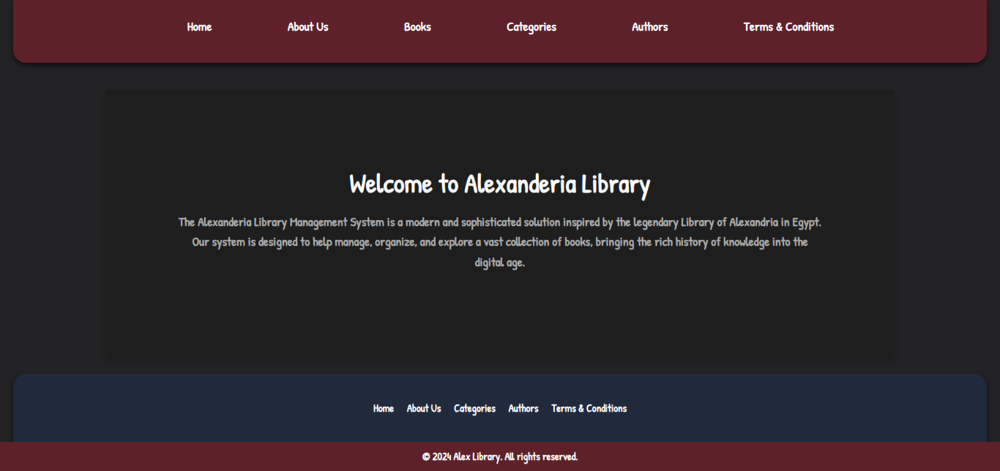

# Alex Library Admin Dashboard

This is the administrative dashboard for the Alex Library system, built with Angular CLI version 18.1.3. The dashboard provides comprehensive management capabilities for books, authors, categories, and other library resources.

## Features

- Books Management
- Authors Management
- Categories Management
- Terms and Conditions Management
- About Us Page Management
- Responsive Design
- User-friendly Interface

## Project Screenshots

### Landing Page

The main dashboard landing page providing quick access to all administrative functions.

### Books Management

Complete interface for managing library books including adding, editing, and removing books.

### Authors Section

Overview of all authors in the system.

### Author Details

Detailed view and management of individual author information.

### Categories Overview

Management interface for book categories.

### Category Details

Detailed view and management of individual categories.

### Terms and Conditions

Management interface for library terms and conditions.

### About Us

Interface for managing the About Us page content.

## Development Setup

### Prerequisites
- Node.js (Latest LTS version)
- Angular CLI
- Package Manager (npm)

### Installation
1. Clone the repository
2. Run `npm install` to install dependencies
3. Run `ng serve` for development server
4. Navigate to `http://localhost:4200/`

### Available Commands

- `ng serve` - Start development server
- `ng build` - Build the project
- `ng test` - Execute unit tests
- `ng e2e` - Execute end-to-end tests

### Build

Run `ng build` to build the project. The build artifacts will be stored in the `dist/` directory.

### Testing

- Run `ng test` to execute unit tests via [Karma](https://karma-runner.github.io)
- Run `ng e2e` to execute end-to-end tests

## Support

For additional help or questions about the Angular CLI, use `ng help` or check out the [Angular CLI Overview and Command Reference](https://angular.dev/tools/cli) page.
